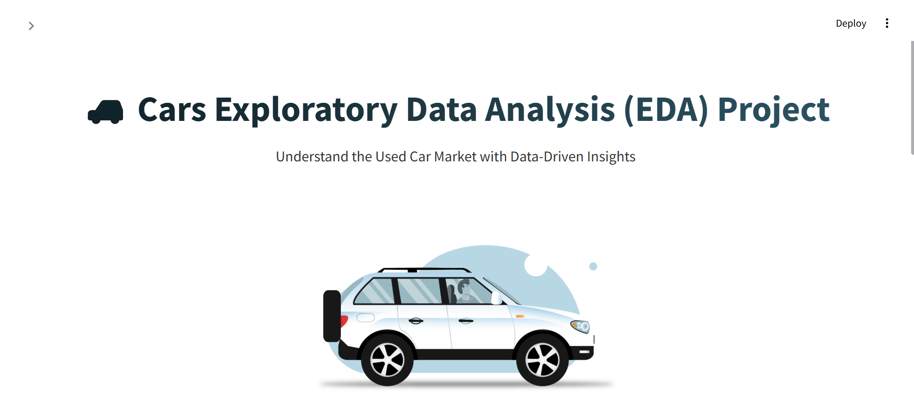
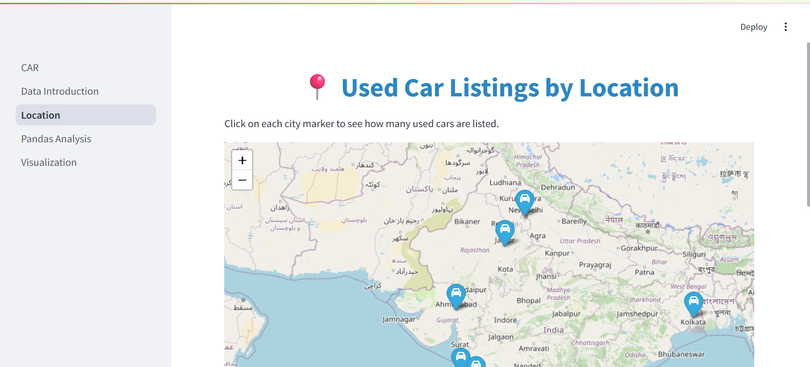

# 🚗 CarVision – AI-Powered Used Car Price Prediction & Recommendation System  

  

> **Understand the Used Car Market with Data-Driven Insights**

---

## 📌 Project Overview

CarVision is an AI-powered web application designed to help users predict the fair price of used cars and explore smart recommendations. The project combines Exploratory Data Analysis (EDA), interactive visualization, and a Machine Learning prediction engine, all integrated into a Streamlit dashboard.
- Car prices by brand and location
- Mileage, engine capacity, transmission types, and more
- Patterns in car color, ownership, and usage
- Geographic distribution of listings

---

## 🗂️ Features

### 📄 1. Data Introduction
- View raw and cleaned datasets side-by-side
- Key cleaning actions: missing value handling, formatting, and feature extraction
- Stylized and animated layout for better UI/UX

### 📊 2. Pandas-Based Analysis
- Summary stats, data types, and memory usage
- Unique value counts and category frequencies
- Most driven cars and price trends by company

### 📍 3. Location Mapping
- Interactive **Folium** map showing number of cars per city
- Tooltips and popups for each location
- Blue car markers for easy visualization

### 📈 4. Data Visualization
- Univariate plots (histograms, boxplots)
- Bivariate plots (scatter, box by category)
- Multivariate analysis (correlation heatmap, hue-based plotting)
- Dynamic dropdown selections for flexible plotting

### 🤖 5. Prediction Engine
- Built a **regression-based ML model** to predict used car prices.  
  - Input features: **Company, Model, Year, Fuel Type, Transmission, Owner Type, Engine (CC), Power (BHP), Kilometers Driven, Location, and Color**.  
  - Model performance:  
    - **R² Score**: ~0.89  
    - **MAE**: ~0.45 Lakh  
    - **RMSE**: ~0.62 Lakh  

### 🎯 6. Smart Recommendation System
  - Suggests up to **4 similar cars** when a prediction is made.  
  - Recommendations displayed as **Flipkart-style cards** with preview images.  
  - Users can explore each recommended car in **different colors and view angles (front, side, rear)** dynamically.  
---

## 🎨 UI and Enhancements

- 📌 Custom **Streamlit theming and animations**
- 🎨 Car-themed styling and transitions
- 🚀 Responsive layout and clean design
- 🧭 Sidebar filters and dropdowns for interactivity
- **Dynamic headings** like *Prediction Engine* and *Smart Recommendations*.
- Car images rendered via **Imagin API** with customization options.  
---

## 📂 Dataset Columns (Cleaned)

- `Name`, `Company_Name`, `Location`, `Year`, `Fuel_Type`, `Transmission`, `Owner_Type`
- `Kilometers_Driven`, `Mileage`, `Engine`, `Power`, `Seats`, `Price`, `Colour`

---

## 🛠️ Technologies Used

| Tool          | Purpose                          |
|---------------|----------------------------------|
| Python        | Core programming                 |
| Pandas        | Data handling and cleaning       |
| Streamlit     | Interactive dashboard            |
| Seaborn/Matplotlib | Data visualization         |
| Folium        | Interactive map rendering        |
| Scikit-Learn  | Model Training & Evaluation  |
| Joblib        | Model Serialization          |
| DuckDuckGo Search | Car Images               |

---

## 📸 Demo Screenshot

  

---
## 🚀 Enhancements After Analysis  
✅ Add price prediction using machine learning  
✅ Add user filters and download options 

## 🌟 Future Improvements  
- Add **deep learning model** for image-based price estimation.  
- Include **real-time web scraping** for up-to-date car data.  
- Integrate **blockchain-based ownership verification** for fraud prevention.  

## 🎯 Objective  
> **CarVision helps users make smarter decisions in the used car market by combining AI-powered price prediction, visual EDA, and personalized recommendations in an interactive dashboard.**

## 📧 Contact
Author: [Lokesh Raghuwanshi]
LinkedIn: www.linkedin.com/in/lokeshraghuwanshi74

